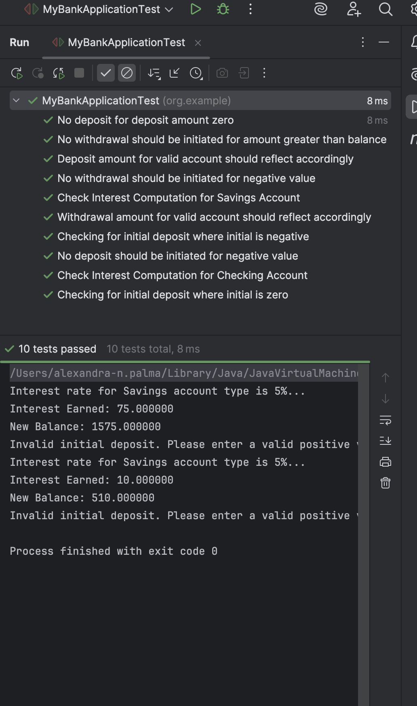
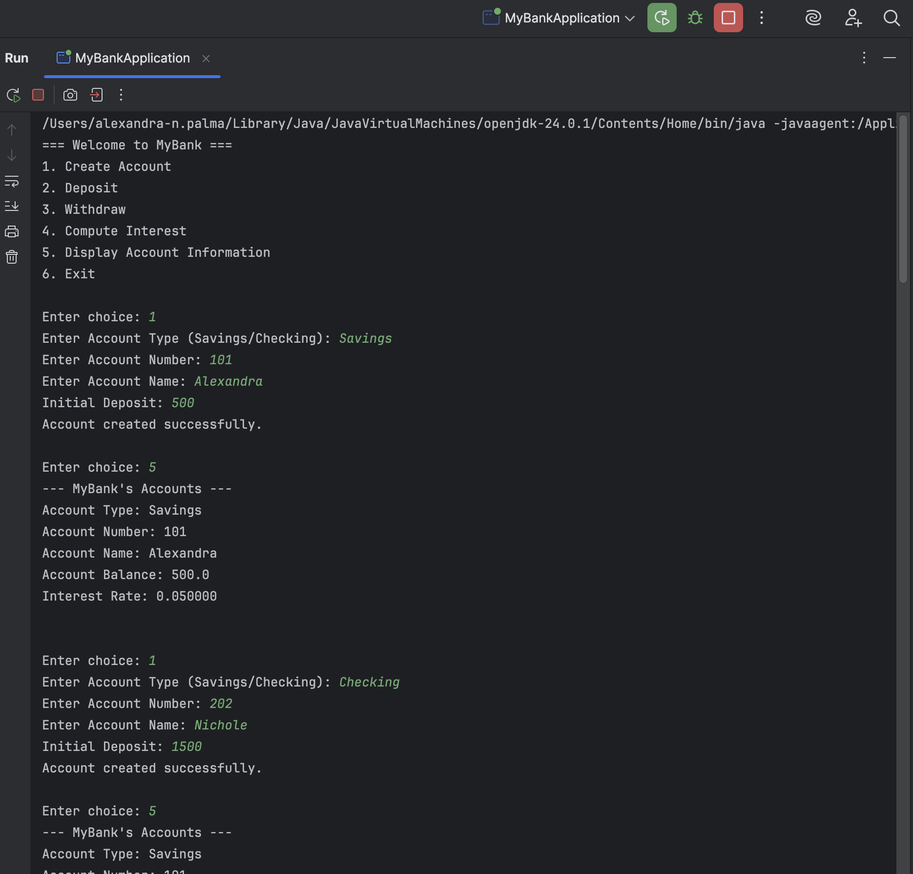
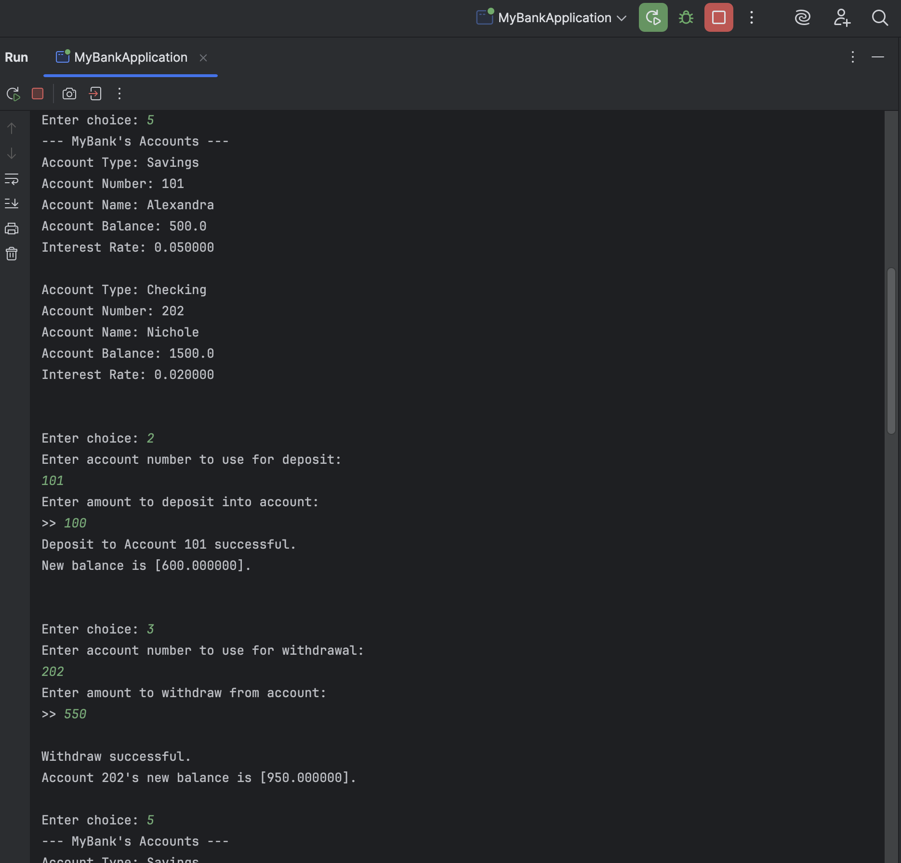
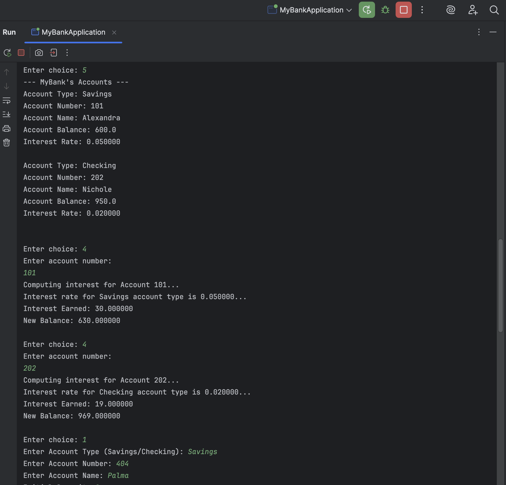
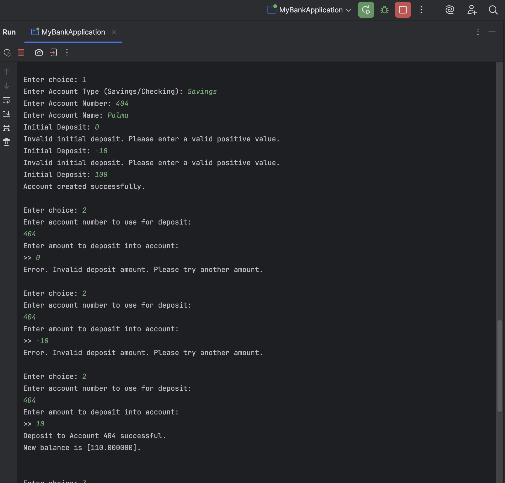
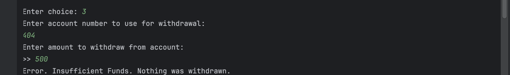
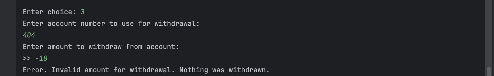
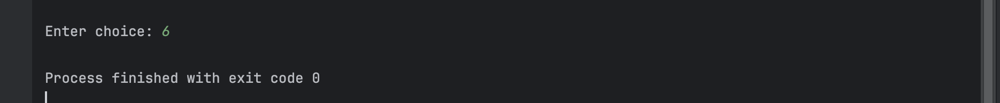

# TU-Java-Session2-OOP-UnitTesting
Java Session 2 Laboratory Exercise

Name: Alexandra Nichole E. Palma 
Project Title: MyBank Application with Unit Testing 
Screenshots: 
 
Unit testing screenshot: 

 
 
Implementation screenshots: 

